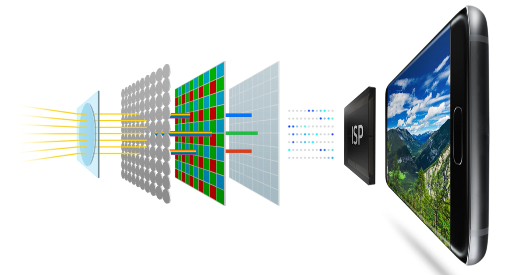
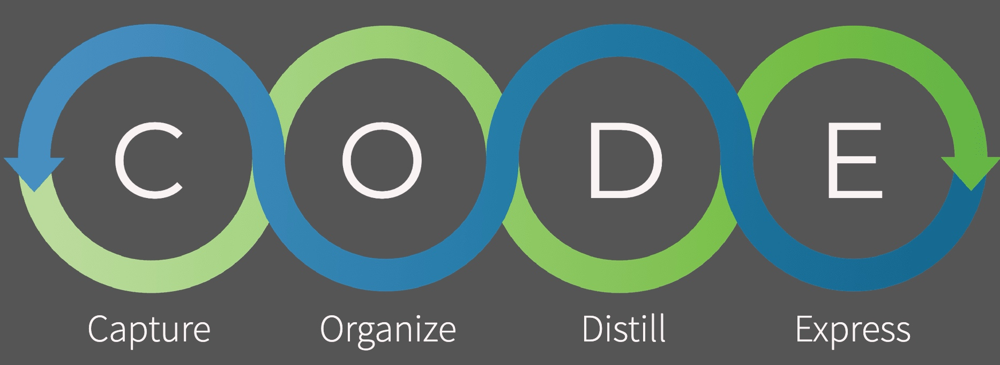

# Introduction {#intro}

Everything with Python and R

You can label chapter and section titles using `{#label}` after them, e.g., we can reference Chapter \@ref(intro). If you do not manually label them, there will be automatic labels anyway, e.g., Chapter \@ref(methods).

Figures and tables with captions will be placed in `figure` and `table` environments, respectively.

```{r nice-fig, fig.cap='Here is a nice figure!', out.width='80%', fig.asp=.75, fig.align='center'}
par(mar = c(4, 4, .1, .1))
plot(pressure, type = 'b', pch = 19)
```

Reference a figure by its code chunk label with the `fig:` prefix, e.g., see Figure \@ref(fig:nice-fig). Similarly, you can reference tables generated from `knitr::kable()`, e.g., see Table \@ref(tab:nice-tab).

```{r nice-tab, tidy=FALSE}
knitr::kable(
  head(iris, 20), caption = 'Here is a nice table!',
  booktabs = TRUE
)
```

You can write citations, too. For example, we are using the **bookdown** package [@R-bookdown] in this sample book, which was built on top of R Markdown and **knitr** [@xie2015].



In conventional contrast AF, ISP calculates the correct adjustment of focus by finding out highest contrast of colors through continuous trials and errors. Phase Detecting AF technology, once only available in premium DSLR cameras, is now available on mobile devices. ISP with PDAF solution calculates the distance from the object and finds the correct adjustment allowing camera to focus at once.



Both Jupyter and Rstudio support the paste images. Best practice than the addin.

```{r}
knitr::include_url("https://yihui.org")
```

    knitr::include_app("https://yihui.shinyapps.io/miniUI/", 
      height = "600px")

```{=html}
<div class="juxtapose">
    
    
</div>
<script src="https://cdn.knightlab.com/libs/juxtapose/latest/js/juxtapose.min.js"></script>
<link rel="stylesheet" href="https://cdn.knightlab.com/libs/juxtapose/latest/css/juxtapose.css">
```
